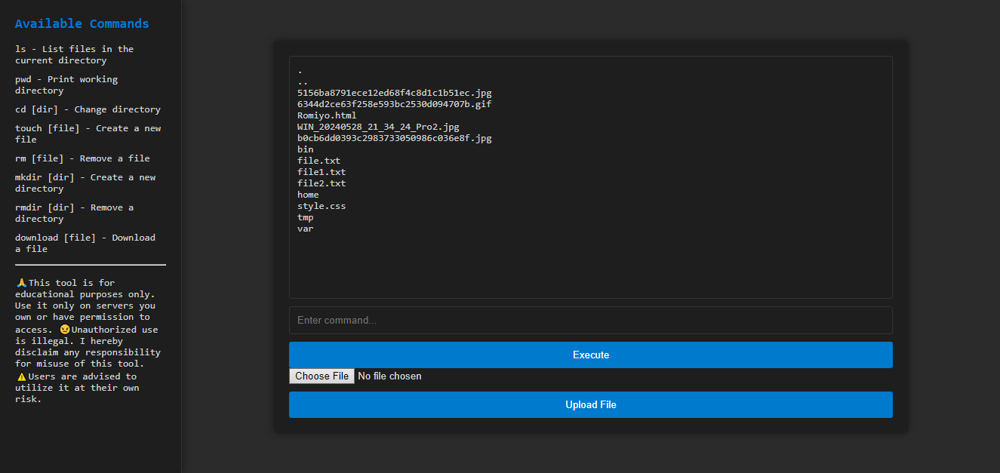
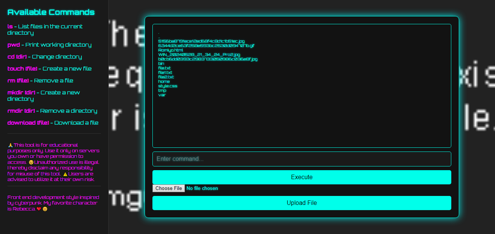

# PHP_Web_SHELL🐘💻🔒

<h3>PHP Web Shell</h3>
<h4>Overview🔍</h4>

This PHP Web Shell is a powerful and versatile tool designed for file system operations directly from a web interface. It includes a wide range of commands such as ls, pwd, cd, touch, rm, mkdir, rmdir, download, and upload, providing a comprehensive set of functionalities for managing files and directories.  
<h3>Capabilities💡</h3>
The web shell does not provide direct access to the server shell (e.g., bash, sh). Instead, it executes predefined PHP functions to manage file system operations.

<h3>Bypassed Restrictions🔓:</h3>
1. <b>Server-Side Command Execution Restrictions:-</b> The web shell executes commands through PHP, potentially bypassing direct command execution restrictions imposed by server configurations.  
2. <b>Web Server Security Measures:-</b> Manages directory changes, file operations, and uploads internally within PHP, which might bypass typical web server protections.  
3. <b>Access Control and Permissions:-</b> Operates under the web server user permissions, which can differ from standard user permissions, allowing for broader access in some cases.  

<h3>Features✨</h3>
Command Execution: Supports a wide range of commands for file and directory operations.
File Upload and Download: Securely upload and download files through the web interface.
Session Management: Keeps track of the current directory using session management.
User-Friendly Interface: Includes a sidebar with available commands and documentation, enhancing usability.
Comprehensive Documentation: Detailed documentation directly within the interface to guide users.

<h3>Usage🔧</h3>
<h4>Available Commands📜</h4>

1. ls - List files in the current directory  
2. pwd - Print working directory  
3. cd [dir] - Change directory  
4. touch [file] - Create a new file  
5. rm [file] - Remove a file  
6. mkdir [dir] - Create a new directory  
7. rmdir [dir] - Remove a directory  
8. download [file] - Download a file  

<h3>Command Execution▶️</h3>
Enter the command in the input field and click "Execute" or tap ENTER on the keyboard. The result will be displayed in the output section.

<h3>File Upload📤</h3>
Select a file to upload using the file input field and click "Upload File". The result will be displayed in the output section.

<h3>Installation🛠️</h3>
To install this web shell, follow these steps: 

Clone the repository to your web server.  
git clone https://github.com/Romeo509/PHP_Web_SHELL.git  
Access the web shell through your web browser.

<h3>Contributing🤝</h3>
Contributions are welcome! Please submit a pull request or open an issue to discuss any changes or improvements.

<h3>⚠️Disclaimer⚠️</h3>
📚Fro educational purpose only📚.
This tool is intended for authorized use only. Unauthorized use or deployment of this tool can lead to severe legal and ethical consequences. Use responsibly.

