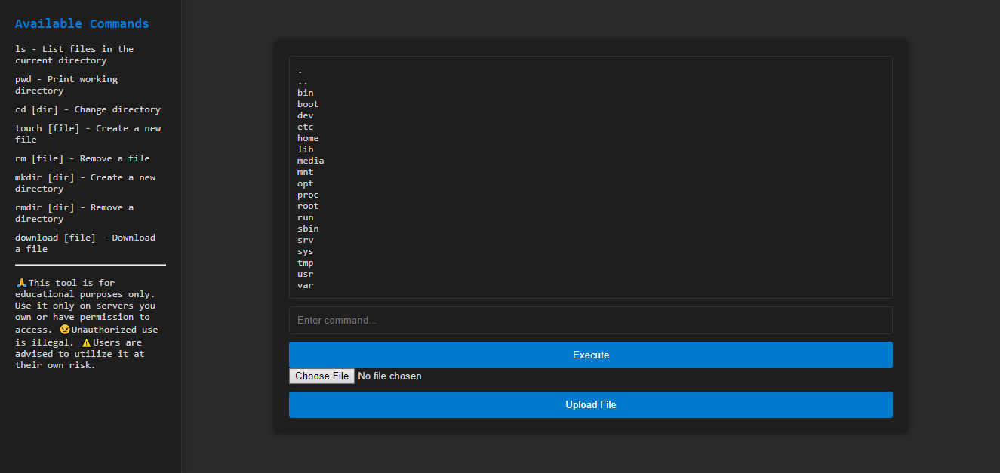
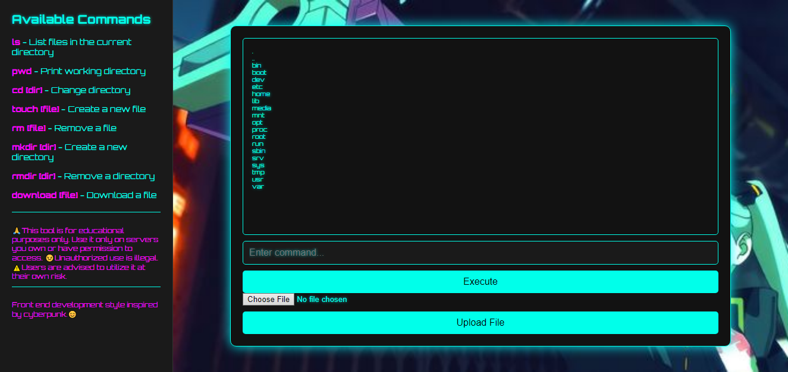

<h1>PHP_Web_SHELL🐘💻🔒</h1>

<h3>PHP Web Shell</h3>
<h4>🔍Overview🔍</h4>
This PHP Web Shell is a simple and versatile tool designed for managing data on a web server directly from a web interface. It includes a wide range of commands such as ls, pwd, cd, touch, rm, mkdir, rmdir, download, and upload, providing a comprehensive set of functionalities for managing files and directories.  

<h3>Capabilities💡</h3>
The web shell does not provide direct access to the server shell (e.g., bash, sh). Instead, it executes predefined PHP functions to manage file system operations.
<h3>Features✨</h3>
1. Command Execution**: Supports a wide range of commands for file and directory operations. 
2. File Upload and Download**: Securely upload and download files through the web interface. 
3. Session Management**: Keeps track of the current directory using session management. 
4. User-Friendly Interface**: Includes a sidebar with available commands and documentation, enhancing usability. 
5. Comprehensive Documentation**: Detailed documentation directly within the interface to guide users. 
<h3>Usage🔧</h3>
<h4>Available Commands📜</h4>
ls - List files in the current directory  
pwd - Print working directory  
cd [dir] - Change directory  
touch [file] - Create a new file  
rm [file] - Remove a file  
mkdir [dir] - Create a new directory  
rmdir [dir] - Remove a directory  
download [file] - Download a file  
<h3>Command Execution▶️</h3>
Enter the command in the input field and click "Execute" or press ENTER on the keyboard. The result will be displayed in the output section.
<h3>File Upload📤</h3>
Select a file to upload using the file input field and click "Upload File". The result will be displayed in the output section.

<h3>Installation🛠️</h3>
To install this web shell, follow these steps: 
Clone the repository to your web server.  
git clone https://github.com/Romeo509/PHP_Web_SHELL.git  
Access the web shell through your web browser.

<h3>Contributing🤝</h3>
Contributions are welcome! Please submit a pull request or open an issue to discuss any changes or improvements.

<h3>⚠️Disclaimer⚠️</h3>
📚Fro educational purpose only📚.
This tool is intended for authorized use only. Unauthorized use or deployment of this tool can lead to severe legal and ethical consequences. Use responsibly.

